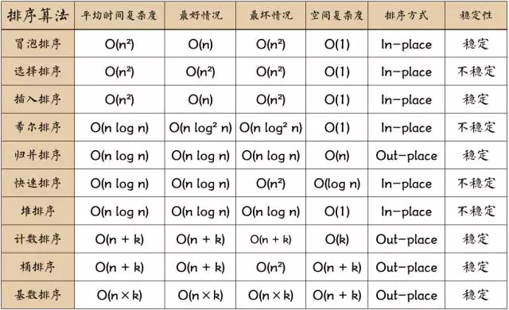
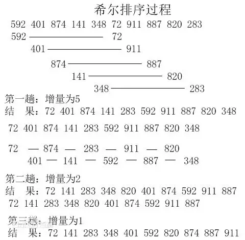
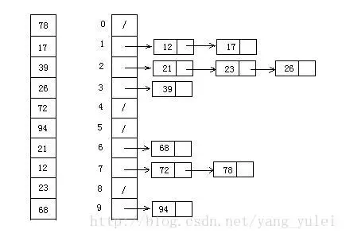

# 排序
## 1. 如何评定算法优劣?
稳定：如果a原本在b前面，而a=b，排序之后a仍然在b的前面；  
不稳定：如果a原本在b的前面，而a=b，排序之后a可能会出现在b的后面；  

内排序：所有排序操作都在内存中完成；  
外排序：由于数据太大，因此把数据放在磁盘中，而排序通过磁盘和内存的数据传输才能进行；  

时间复杂度: 一个算法执行所耗费的时间。  
空间复杂度: 运行完一个程序所需内存的大小。  

## 2. 排序对比:
  
图片名词解释：  
n: 数据规模  
k:“桶”的个数  
In-place: 占用常数内存，不占用额外内存  
Out-place: 占用额外内存  

## 3. 部分算法动画演示
* 冒泡排序   BubbleSort :  
数据样本: [3, 44, 38, 5, 47, 15, 36, 26, 27, 2, 46, 4, 19, 50, 48]  
  

* 选择排序   SelectionSort :  
数据样本: [3, 44, 38, 5, 47, 15, 36, 26, 27, 2, 46, 4, 19, 50, 48]  

* 插入排序   InsertionSort :  
数据样本: [3, 44, 38, 5, 47, 15, 36, 26, 27, 2, 46, 4, 19, 50, 48]  

* 希尔排序   ShellSort :  

* 归并排序   MergeSort :  
数据样本: [3, 44, 38, 5, 47, 15, 36, 26, 27, 2, 46, 4, 19, 50, 48]  

* 快速排序   QuickSort :  
数据样本: [3, 44, 38, 5, 47, 15, 36, 26, 27, 2, 46, 4, 19, 50, 48]  

* 堆排序   HeapSort :  
数据样本: [91, 60, 96, 13, 35, 65, 46, 65, 10, 30, 20, 31, 77, 81, 22]  

* 计数排序  CountingSort :  
数据样本：[2, 2, 3, 8, 7, 1, 2, 2, 2, 7, 3, 9, 8, 2, 1, 4, 2, 4, 6, 9, 2]  

* 桶排序   BucketSort :  
